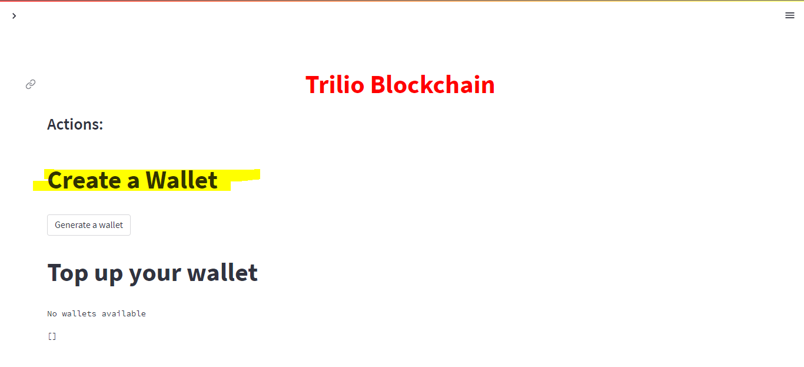
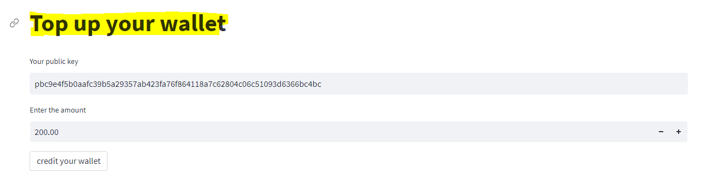
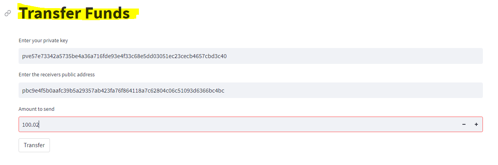
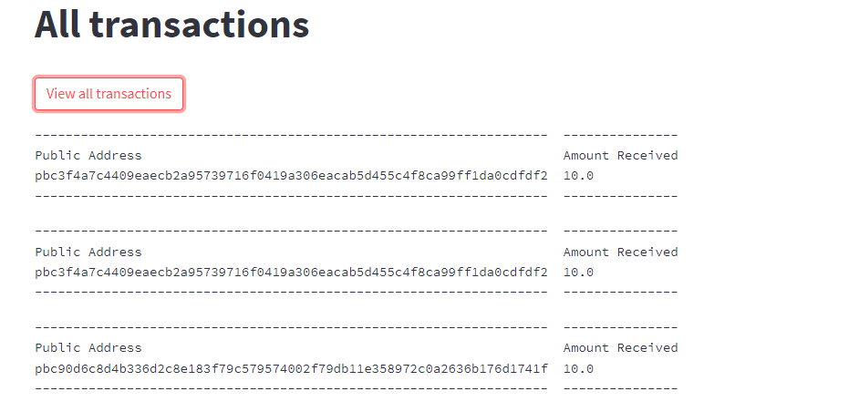

# Trillio Blockchain
This is a crypto wallet simulation project made with python. The application is a representation of how a crypto wallet works with very minimal code.

# Prerequisite Software/ Packages

i) [Python](https://www.python.org/) Install python using the link  
ii) [Streamlit](https://streamlit.io/) Run 'pip install streamlit' in cmd  
iii) [Tabulate](https://pypi.org/project/tabulate/) Run 'pip install tabulate' in cmd  

# Setup and Run the Project
i) Clone or download file to your directory  
ii) Make sure all packages are installed correctly  
iii) Open cmd in the directory  
iv) Run 'streamlit run main_frontend.py'

Completing these steps will run the project on your localhost at port 8501 or any other available port.

# Guide to use the application:

## 1. Create a wallet

Click the 'Generate a Wallet' button to get a virtual wallet.

## 2. Credit your wallet

Enter your public address you got and the amount of credits you want then press the button to receive your credits.

## 3. Transfer Credits to another wallet

Enter the receiver's public address, your private key and the amount of credits you wish to transfer then press the button.

## 4. View all Transactions

Clicking the button will show a list of all the transactions in the network.